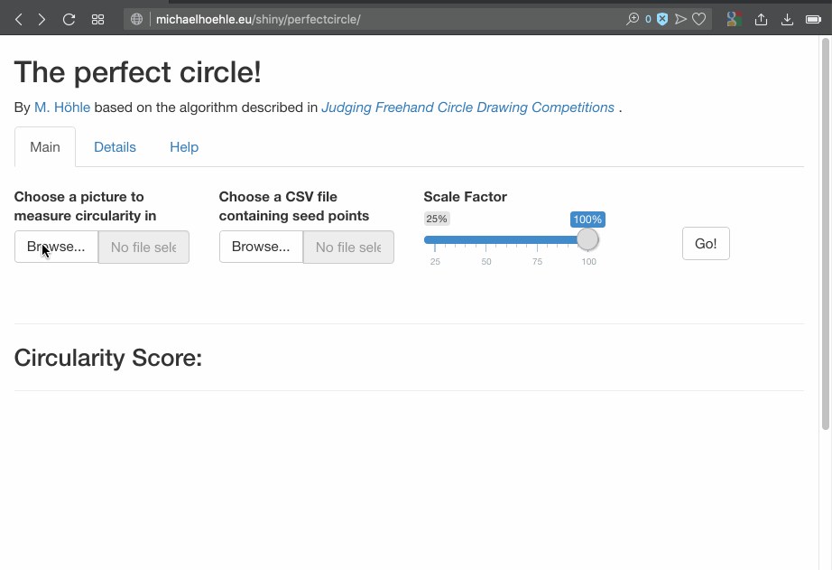

# perfectcircle

A packaged version of the functionality described in the blog post [Judging Freehand Circle Drawing Competitions](https://staff.math.su.se/hoehle/blog/2018/07/31/circle.html).

In order to use the package you will need to download and install [R](https://cran.r-project.org/) for your computer. After installation, open R and write the following on the console:

    install.packages("devtools")
    devtools::install_github("hoehleatsu/perfectcircle")
    library(perfectcircle)
    perfectcircle::runExample()

This will run the accompanying Shiny app locally, which is the fastest way to analyse circles.

The [Image file](https://github.com/hoehleatsu/perfectcircle/blob/master/inst/extdata/AlexOverwijk.jpg) and [CSV file](https://raw.githubusercontent.com/hoehleatsu/perfectcircle/master/inst/extdata/AlexOverwijk.csv) from the package's `extdata` folder can be downloaded to your local machine to test the app. Currently, the Shiny file selector does not allow the specification of URLs. The two files correspond to the setting used in the blog post.

Instead of installing the package one can also run the Shiny App directly from
[https://michaelhoehle.eu/shiny/perfectcircle/](https://michaelhoehle.eu/shiny/perfectcircle/).

Using the app:

